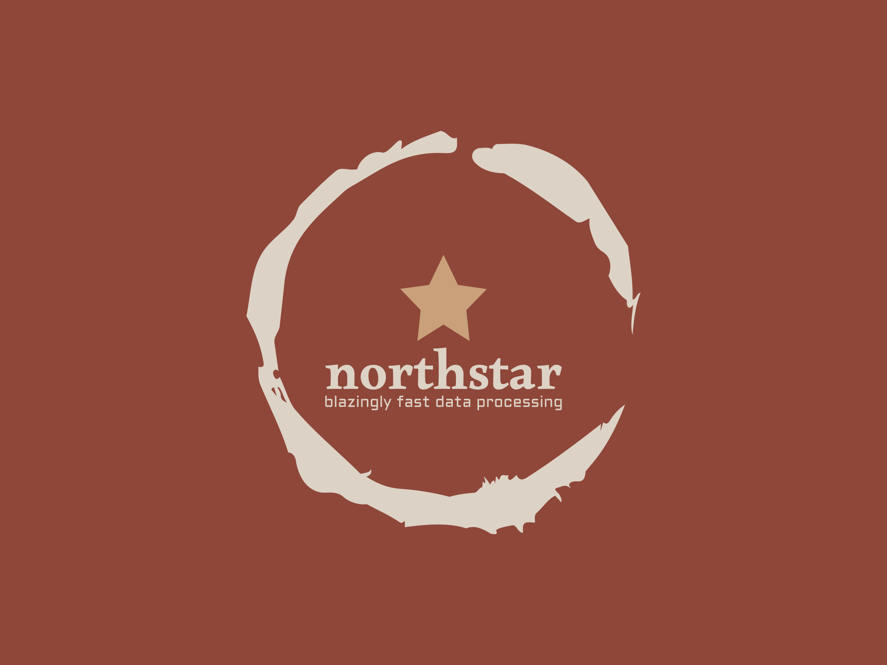
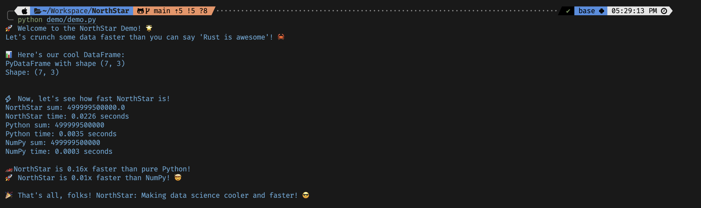

# 🌟 NorthStar: Blazingly Fast Data Processing 🚀

<center>


NorthStar is a high-performance data processing library implemented in Rust with Python bindings. It's designed to make your data science workflows faster and cooler! 😎

</center>

## 🌈 Features

- 🦀 Rust-powered core for lightning-fast computations
- 🐍 Seamless Python integration
- 📊 Efficient DataFrame and Series operations
- 🚄 Optimized for speed and memory usage

## 🛠️ Installation

Get started with NorthStar in seconds:

```bash
pip install northstar-data
```
[Find the package here!!!](https://pypi.org/project/northstar-data/0.1.0/)

## 🚀 Quick Start

Here's a taste of what NorthStar can do:

```python
import northstar as ns

# Create a DataFrame
df = ns.PyDataFrame()
df.add_series(ns.PySeries("ages", [25, 30, 22, 28, 33]))
df.add_series(ns.PySeries("names", ["Alice", "Bob", "Charlie", "David", "Eve"]))
df.add_series(ns.PySeries("scores", [88.5, 92.0, 79.5, 95.5, 87.0]))
```

## 🏎️ Performance

NorthStar is designed for speed. Here's a quick comparison:

```python
import northstar as ns
import time

data = list(range(1_000_000))

start_time = time.time()
ns_series = ns.PySeries("big_data", data)
ns_sum = ns_series.sum()
ns_time = time.time() - start_time

print(f"NorthStar time: {ns_time:.4f} seconds")

start_time = time.time()
py_sum = sum(data)
py_time = time.time() - start_time

print(f"Python time: {py_time:.4f} seconds")

speedup = py_time / ns_time
print(f"NorthStar is {speedup:.2f}x faster than pure Python!")
```



## 🛣️ Roadmap

We're just getting started! Here's what's coming:

- [ ] Trying to make it much faster 🏎️
- [ ] Advanced grouping and aggregation operations
- [ ] More statistical functions (median, mode, standard deviation)
- [ ] DataFrame join operations
- [ ] Enhanced data visualization capabilities
- [ ] Even more performance optimizations

## 🤝 Contributing

We'd love your help to make NorthStar even more awesome! Check out our [Contributing Guide](CONTRIBUTING.md) to get started.

## 📜 License

NorthStar is MIT licensed. See the [LICENSE](LICENSE) file for details.

## 🌟 Star Us!

If you find NorthStar helpful, give us a star on GitHub! It helps us know we're on the right track and encourages us to keep improving.

Happy data crunching! 🚀📊🦀